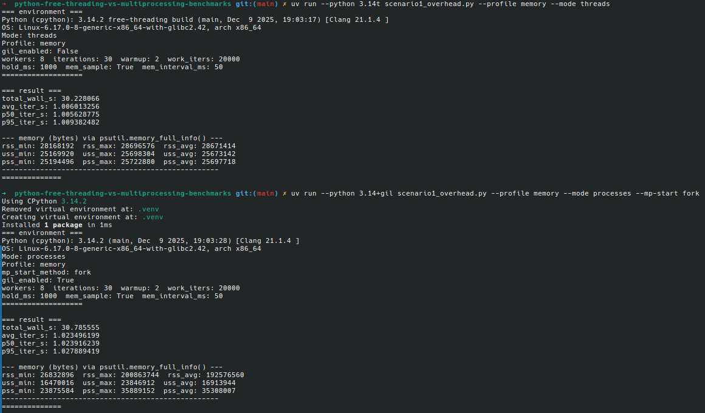
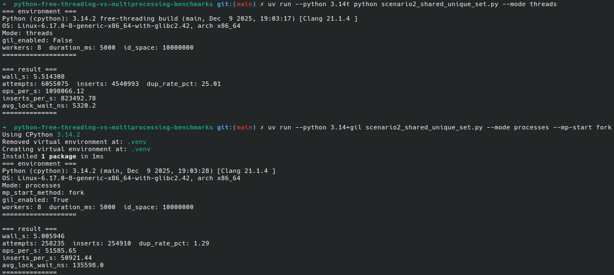
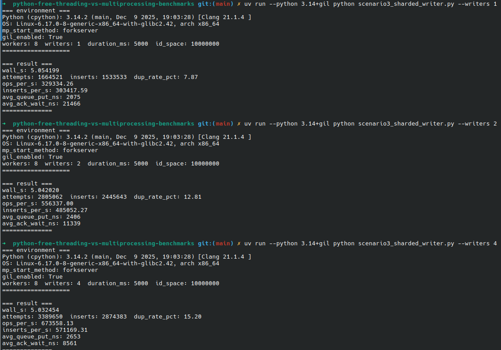

# Free-Threading Python vs Multiprocessing: Overhead, Memory, and the Shared-Set Meltdown

Last time, we did the classic Python party trick:

- **Same code**
- **Same machine**
- Two realities:
  - **Standard CPython** (GIL on) → threads behave like a single checkout lane
  - **Free‑threading build** (GIL off) → threads can actually run in parallel

That post answered a very specific question: *"Do threads finally do real CPU parallelism in Python?"*  
Answer: **yes, in the free‑threading build**. And the OS agrees.

Now comes the annoying follow‑up that matters in real systems:

> Cool. But should I use free‑threading **threads**… or just stick with **processes** like we’ve all been doing for 15 years?

This new series is about that tradeoff — not as ideology ("threads good / processes bad"), but as boring physics: **time, memory, and overhead**.

---

## Why I’m writing this

The old Python concurrency rulebook was simple:

- Threads are for **I/O**
- Processes are for **CPU**
- If you want speed, push the hot loop into **Fortran/C/C++/Rust**

That rulebook existed because the GIL made CPU‑bound threads mostly a scheduling cosplay.

Free‑threading changes that. It doesn’t make Python bytecode faster per instruction — it makes threads stop taking turns behind one global lock.  
Which means:

- Threads are no longer automatically "fake CPU parallelism"
- But processes still give you things threads never will: isolation, separate heaps, separate crashes, separate GILs, etc.

So the question isn’t "which is better?"

It’s:

> **What’s the tax you pay to get parallelism?**  
> And when does that tax matter more than your algorithm?

Scenario 1 is the "before you even talk about your workload" benchmark.

## TL;DR punchline

* Threads: low control‑plane cost, tight memory footprint.
* Processes: fine for chunky work; brutal for tiny work on spawn-heavy platforms.
* Shared state: can erase your parallelism no matter what you pick.

## Methodology

### Python builds

| OS                                 |                                                                GIL build | Free-Threading build                                                                          |
|------------------------------------|-------------------------------------------------------------------------:|-----------------------------------------------------------------------------------------------|
| Ubuntu 25.10 (Linux 6.17, x86_64)  |            cpython, 3.14.2 (main, Dec  9 2025, 19:03:28) [Clang 21.1.4 ] | cpython, 3.14.2 free-threading build (main, Dec  9 2025, 19:03:17) [Clang 21.1.4 ]            | 
| Windows 11 Pro (25H2, AMD64)       | cpython, 3.14.2 (main, Dec 9 2025, 19:03:14) [MSC v.1944 64 bit (AMD64)] | cpython, 3.14.2 free-threading build (main, Dec 9 2025, 19:04:12) [MSC v.1944 64 bit (AMD64)] |
| Apple M3 Max, Version 26.2 (25C56) |             cpython, 3.14.2 (main, Dec 9 2025, 19:29:30) [Clang 21.1.4 ] | cpython, 3.14.2 free-threading build (main, Dec 9 2025, 20:27:05) [Clang 21.1.4 ]             |

1. **Machine A (Ubuntu 25.10 and Windows 11 Pro)**:
   - CPU: AMD Ryzen 9 9950X 16-Core Processor
   - RAM: Corsair CMT64GX5M2B6000Z30 2x32GiB DDR5 6000 MT/s
2. **Machine B (macOS): Apple M3 Max**

Threads use the free‑threading build and processes use the GIL build. This is a pragmatic comparison: threads only get interesting on free‑threading, while most people still run processes on stock CPython. It does mean interpreter-build differences are in the mix, and free‑threading can shift allocator/GC/lock behavior. If you want a pure build-to-build control, re-run processes under the free‑threading build on the same OS to measure that delta explicitly.

## Scenario 1: "What’s the tax of choosing threads vs processes?"

This scenario measures two system‑level costs:

1. **Control‑plane cost**: how expensive it is to *create / start / join / tear down* workers  
2. **Footprint cost**: how much memory those workers consume while alive

It’s deliberately boring. That’s the point.

If your real system does *lots of tiny jobs*, boring overhead becomes the main character.

---

## The benchmark in one paragraph

Each iteration does:

1. Create **N workers** (N=8 here)
2. Run a tiny CPU function
3. Join workers
4. Repeat

There are two profiles:

### Profile: `overhead`
- Workers do one tiny CPU task and immediately exit
- Run **1000 iterations**
- Goal: **isolate startup + teardown overhead**

> Pool warning: this is the worst‑case for processes. A long‑lived pool pays most of this cost once (warmup), then per‑task overhead shifts to dispatch + IPC/serialization. 
> On Windows/macOS, worker creation is still `spawn`, even for pools. If your design really does short‑lived processes per job (serverless‑ish, CLI fanout, test runners), then yes, this is your life. 
> Thread pools exist too, but thread create cost is usually low enough that reuse matters less.

How to run the benchmark, commit [7eb0204](https://github.com/REASY/python-free-threading-vs-multiprocessing-benchmarks/commit/7eb020478492043999a4b86a48a115a07c0adadb):

| Mode                   | Start method |                                                                                                    Command |
|------------------------|-------------:|-----------------------------------------------------------------------------------------------------------:|
| free‑threading threads |            — |                            `uv run --python 3.14t scenario1_overhead.py --profile overhead --mode threads` |
| processes              |         fork |       `uv run --python 3.14+gil scenario1_overhead.py --profile overhead --mode processes --mp-start fork` |
| processes              |   forkserver | `uv run --python 3.14+gil scenario1_overhead.py --profile overhead --mode processes --mp-start forkserver` |
| processes              |        spawn |      `uv run --python 3.14+gil scenario1_overhead.py --profile overhead --mode processes --mp-start spawn` |

### Profile: `memory`
- Workers stay alive for **hold_ms = 1000ms** doing CPU work
- Sample memory repeatedly using `psutil.memory_full_info()`:
  - **RSS** (resident)
  - **USS** (unique/private)
  - **PSS** (shared pages split fairly; Linux-only)
- Memory stats are summed across **the parent and all worker processes**
- Goal: **measure memory footprint under sustained load**

How to run the benchmark, commit [7eb0204](https://github.com/REASY/python-free-threading-vs-multiprocessing-benchmarks/commit/7eb020478492043999a4b86a48a115a07c0adadb):

| Mode                   | Start method |                                                                                                  Command |
|------------------------|-------------:|---------------------------------------------------------------------------------------------------------:|
| free‑threading threads |            — |                            `uv run --python 3.14t scenario1_overhead.py --profile memory --mode threads` |
| processes              |         fork |       `uv run --python 3.14+gil scenario1_overhead.py --profile memory --mode processes --mp-start fork` |
| processes              |   forkserver | `uv run --python 3.14+gil scenario1_overhead.py --profile memory --mode processes --mp-start forkserver` |
| processes              |        spawn |      `uv run --python 3.14+gil scenario1_overhead.py --profile memory --mode processes --mp-start spawn` |

## Scenario 1 results (Ubuntu 25.10 + Windows 11 Pro + Apple M3 Max)

Same knobs everywhere:

- **workers = 8**
- **overhead**: 1000 iterations
- **memory**: 30 iterations, **hold_ms = 1000**, sample every 50ms

### Ubuntu 25.10 (Linux 6.17, x86_64)

#### Overhead profile (avg time per iteration)

| Mode                   | Start method | avg iter (ms) | relative to threads |
|------------------------|-------------:|--------------:|--------------------:|
| free‑threading threads |            — |         1.832 |               1.00× |
| processes              |         fork |         3.121 |               1.70× |
| processes              |   forkserver |         4.474 |               2.44× |
| processes              |        spawn |        32.851 |              17.93× |

Linux takeaway: you get the full menu (`fork`, `forkserver`, `spawn`). For tiny jobs, **`fork` wins**, `forkserver` is okay, and `spawn` is the "boot a fresh interpreter" tax. It’s the safest and most portable method… and also the one that makes tiny tasks feel like trying to start Kubernetes for every HTTP request. On Linux/macOS, `fork` benefits from copy‑on‑write;
> Crucial Note on fork: Forking after threads is unsafe and could lead to deadlocks: the child inherits the **locked state** but **not the threads** that would unlock it. (See CPython issue: https://github.com/python/cpython/issues/84559)

#### Memory profile (avg during the 1s hold)

Linux gives you **PSS**, which is the best available approximation for multi-process memory on Linux.

| Mode                   | Start method | RSS avg (MB) | USS avg (MB) | PSS avg (MB) |
|------------------------|-------------:|-------------:|-------------:|-------------:|
| free‑threading threads |            — |         28.1 |         25.2 |         25.2 |
| processes              |         fork |        160.0 |         15.5 |         30.5 |
| processes              |   forkserver |        164.5 |         33.6 |         46.9 |
| processes              |        spawn |        180.7 |         92.1 |         99.0 |

Read that like this:

- RSS looks massive for processes because it double-counts shared pages.
- `fork` keeps **USS** small (copy-on-write sharing).
- `spawn` blows up **USS/PSS** because it’s "fresh interpreter per worker".

---

### Windows 11 Pro (25H2, AMD64)

#### Overhead profile (avg time per iteration)

Windows is effectively **spawn-only**, and you can see it in the bill (it calls [CreateProcess](https://learn.microsoft.com/en-us/windows/win32/api/processthreadsapi/nf-processthreadsapi-createprocessa), which is a heavyweight operation)

| Mode                   | Start method | avg iter (ms) | relative to threads |
|------------------------|-------------:|--------------:|--------------------:|
| free‑threading threads |            — |         2.675 |               1.00× |
| processes              |        spawn |        70.944 |              26.52× |

#### Memory profile (avg during the 1s hold)

Again: no PSS, so **USS** is the closest analogue to "private cost" on Windows.

| Mode                   | Start method | RSS avg (MB) | USS avg (MB) | note                            |
|------------------------|-------------:|-------------:|-------------:|---------------------------------|
| free‑threading threads |            — |         33.9 |         19.9 | one process                     |
| processes              |        spawn |        184.2 |        105.0 | separate interpreter per worker |

---

### Apple M3 Max (macOS 26.2, arm64)

#### Overhead profile (avg time per iteration)

| Mode                   | Start method | avg iter (ms) | relative to threads |
|------------------------|-------------:|--------------:|--------------------:|
| free‑threading threads |            — |         3.087 |               1.00× |
| processes              |         fork |        10.621 |               3.44× |
| processes              |   forkserver |        14.751 |               4.78× |
| processes              |        spawn |        51.600 |              16.72× |

What to notice:

- `spawn` on macOS is **brutal** for short jobs. Every iteration is basically "start a mini Python program 8 times".
- `fork` is much cheaper **because it clones an existing process** (copy‑on‑write does a lot of the heavy lifting), but `fork` after threads is unsafe.

#### Memory profile (avg during the 1s hold)

macOS doesn’t report PSS here, so use **USS** as your "how much is truly mine" number.

| Mode                   | Start method | RSS avg (MB) | USS avg (MB) | note                              |
|------------------------|-------------:|-------------:|-------------:|-----------------------------------|
| free‑threading threads |            — |         33.9 |         22.5 | one process                       |
| processes              |         fork |        105.8 |         29.1 | CoW keeps USS low-ish             |
| processes              |   forkserver |        132.8 |         65.6 | more bootstrap, more unique pages |
| processes              |        spawn |        249.2 |        153.3 | fresh interpreter per worker      |

> Note on Threads: You might wonder why RSS (33.9) is higher than USS (22.5) even for a single threaded process. The OS counts shared system libraries (like libc or dyld) in RSS, but they don't count towards USS.

---

### Scenario 1 summary

If your workload looks like "lots of small tasks":

1. Free‑threading **threads** are the cheap option:  **low startup overhead** and **tight memory footprint** (control-plane cost stays small).
2. **Processes** can be *wildly* expensive on platforms where `spawn` is the default/only sane option (Windows, and often macOS in practice). Startup overhead varies wildly by start method and memory story depends on how much can be shared (fork) vs duplicated (spawn).

If your tasks are chunky (seconds+), none of this matters — you’ll drown out the startup tax with real work.  
But if you’re building a system that lives on tiny tasks… this is the part that quietly eats your lunch.

## Scenario 2: Shared mutable state (aka: how to delete your parallelism)

Why Ubuntu only? Because based on Scenario 1’s overhead numbers, Linux was the fastest of the three platforms I tested:

- threads avg iteration: **1.832 ms** (Linux) vs **2.675 ms** (Windows) vs **3.087 ms** (macOS)
- processes `spawn` avg iteration: **32.851 ms** (Linux) vs **70.944 ms** (Windows) vs **51.600 ms** (macOS)

So if there’s a platform where you should *expect* concurrency overheads to be the least embarrassing, it’s Linux.

Scenario 1 was the entry fee: *startup tax* and *RAM tax*.

Scenario 2 is where things get spicy because it models a pattern people accidentally build all the time:

> "Let’s do CPU work in parallel… but also everyone updates one shared set / dict / cache."

This is the **shared mutable state** benchmark. It’s not trying to be fair. It’s trying to be honest.

### Workload

Each worker loops for **5 seconds** doing:

1. generate a pseudo-random ID
2. take a lock
3. check if it exists in a global set
4. if not, insert it
5. release lock

IDs are mapped into a fixed space (`id_space = 10,000,000`) so duplicates naturally show up once the set fills.

### Implementation details

The benchmark is implemented in `scenario2_shared_unique_set.py`:

- **Threads mode (free‑threading build):**
  - `shared_set = set()` in the same process
  - `lock = threading.Lock()`
  - a `threading.Barrier` is used so all threads start the timed loop together (fair start, no "early thread head-start")  

- **Processes mode (regular CPython, GIL on):**
  - `shared_set = multiprocessing.Manager().dict()` (proxy object backed by a manager process)
  - `lock = ctx.Lock()` shared by all workers
  - each process does **IPC** to the manager for `uid in dict` and `dict[uid] = 1`

**"Wait, why use `Manager`?"** I know, I know — I could have used raw `multiprocessing.shared_memory` or Redis to optimize this. But most Python developers reach for `Manager` because it looks like a Python dict. This benchmark measures the cost of that convenience.

Cost model (why the gap is so large):

- Threads critical section: a few pointer-chasing ops + a hash.
- Manager critical section: IPC transport (pipe/AF_UNIX/named pipe) + pickle + manager scheduling + manager GIL + unpickle + dict op + reply.

> IPC transport differs by OS; the cost profile is similar.

The lock `lock` isn’t protecting dict internals; it’s protecting the **check-then-insert** as one atomic operation: we do two Manager proxy calls (uid in dict, dict[uid]=1). Those are IPC + pickling + context switches. So the critical section becomes expensive, and everyone queues behind it. **That** is why the latency numbers you are about to see look the way they do — we added a **mini client/server system** in the hottest part of the loop.

> Amdahl's law: If every worker must pass through one narrow critical section, you’ve capped throughput — the only question is how expensive each pass is.

So Scenario 2 is really benchmarking: **lock contention + IPC + proxy overhead**, not "processes are slow".

### How to run the benchmark, commit [7eb0204](https://github.com/REASY/python-free-threading-vs-multiprocessing-benchmarks/commit/7eb020478492043999a4b86a48a115a07c0adadb):

| Mode                   | Start method |                                                                                          Command |
|------------------------|-------------:|-------------------------------------------------------------------------------------------------:|
| free‑threading threads |            — |                     `uv run --python 3.14t python scenario2_shared_unique_set.py --mode threads` |
| processes              |         fork |       `uv run --python 3.14+gil scenario2_shared_unique_set.py --mode processes --mp-start fork` |
| processes              |   forkserver | `uv run --python 3.14+gil scenario2_shared_unique_set.py --mode processes --mp-start forkserver` |
| processes              |        spawn |      `uv run --python 3.14+gil scenario2_shared_unique_set.py --mode processes --mp-start spawn` |

### Results (Ubuntu 25.10 / Linux 6.17 / x86_64)

**Threads (free‑threading, 8 workers):**

- **1,098,066.12 ops/s** (attempted check+insert)
- **823,492 inserts/s**
- avg lock wait: **5.32 µs**
- duplicates: **25.01%** (because the set actually gets big)

**Processes (8 workers):** the start method basically doesn’t matter here.

| mp_start   |  ops/s | inserts/s | avg lock wait | relative to threads |
|------------|-------:|----------:|--------------:|--------------------:|
| forkserver | 51,920 |    51,235 |      134.5 µs |        21.0× slower |
| fork       | 51,585 |    50,921 |      135.5 µs |        21.2× slower |
| spawn      | 50,333 |    49,687 |      138.0 µs |        21.6× slower |

Also notice the lock wait ratio: in processes mode the "wait to acquire the lock" is about **25.4×** higher (≈135.5 µs vs 5.32 µs).  
That’s not just contention — it’s "you made the critical section slow, so everyone queues longer".

### "But the duplicate rate is different!" — yep, and here’s why

Threads did **~4.5 million inserts** into a **10 million** ID space in 5.5 seconds (`wall_s`) — we’re at ~45% occupancy, so duplicates start showing up a lot.

Processes only managed ~250k inserts — ~2.5% occupancy — so of course the duplicate rate stays low.

So don’t compare duplicate rate across modes. Compare **ops/s** and **lock wait**, because those reflect the actual bottleneck.

### What this teaches (and what it does *not* teach)

This does **not** say:

- "processes are useless"
- "threads always win"
- "free-threading solved everything"

It says something narrower and more useful:

> If you try to do multiprocessing *and* keep a single shared mutable data structure consistent with a lock + manager proxy,  
> you just built a distributed system with one tiny database… and then put it in your inner loop.

That’s why it collapses to ~50k ops/s.

### Practical takeaways

If you’re in **threads** (free-threading build):

- Shared structures and a lock can be totally fine… until the lock becomes the program.
- `avg_lock_wait_ns` is your "are we turning into a single lane?" early warning signal.

If you’re in **processes**:

- Avoid "shared dict/set with Manager + lock" for hot paths.
- Prefer:
  - **sharding** (each worker owns a subset; merge later)
  - **local sets + reduce** (map/reduce style)
  - **message passing** (queues) instead of shared state
  - **real shared memory** only if you absolutely must (and you’re ready for pain)

Scenario 2 is the cautionary tale: multiprocessing gives parallel CPU, but a shared mutable state can delete it.

## Scenario 3: Sharded writers (multiprocessing without shared state)

Scenario 2 used a `Manager().dict()` and a shared lock, which turns every "check + insert" into IPC.  
Scenario 3 replaces that with **M writer processes**, each owning a shard of the set, and routes items by hash so the same key always lands on the same writer.

### Workload idea

- **M writer processes** each hold a local `set`.
- **N producers** generate IDs and send `(worker_id, uid)` to a shard queue: `shard = uid % writers`.
- The writer does `uid in set` and, if new, `set.add(uid)`, then sends an ACK back to the producer.
- Each producer blocks on its ACK before sending the next ID, so insert/duplicate is explicit and counts are exact.

Each writer is still single‑threaded, but now **different keys can be handled in parallel**.  
We’ve removed the manager proxy and the shared lock; the only shared cost is IPC + ACK per item.

### How to run

`uv run --python 3.14+gil python scenario3_sharded_writer.py --writers N`

### Results (Ubuntu 25.10 / Linux 6.17 / x86_64)

**8 producers, varying writer shards:**

| writers |      ops/s |  inserts/s | dup_rate_pct | avg queue_put, ns | avg ack_wait, ns |
|---------|-----------:|-----------:|-------------:|------------------:|-----------------:|
| 1       | 329,334.26 | 303,417.59 |         7.87 |             2,075 |           21,466 |
| 2       | 556,337.00 | 485,052.27 |        12.81 |             2,406 |           11,339 |
| 4       | 673,558.13 | 571,169.31 |        15.20 |             2,653 |            8,561 |
| 8       | 711,093.02 | 597,812.42 |        15.93 |             2,781 |            7,775 |

Compared to Scenario 2's ~50k ops/s for manager+lock, even the 1‑writer baseline is ~6× faster.  
Sharding scales it further, and the mean ACK wait drops as writers fan out, but the queue put cost stays flat. That tells you the ceiling is still IPC + scheduling, not the set itself.

## References
- [Python support for free threading](https://docs.python.org/3/howto/free-threading-python.html)
- [multiprocessing — Process-based parallelism](https://docs.python.org/3/library/multiprocessing.html)
- [fork(2) — Linux manual page](https://man7.org/linux/man-pages/man2/fork.2.html)
- [psutil.Process.memory_full_info](https://psutil.readthedocs.io/en/latest/index.html#psutil.Process.memory_full_info)
- [Memory Vss/rss/pss/uss noun Explanation](https://topic.alibabacloud.com/a/memory-vssrsspssuss-noun-explanation_8_8_31217546.html)
